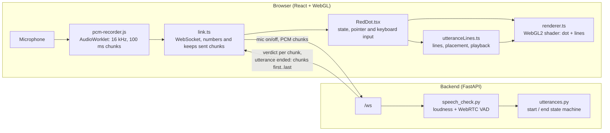

# RedDot


**RedDot is a frontend for voice input.** Hold the red dot and speak: the dot reacts while it hears speech, and every finished utterance appears as a small wavy line next to it. Tap a line to hear the utterance again, drag lines and the dot around the screen.

The goal of the project is a **testbed for AI agents that process voice recordings**: speech-to-text engines, language models and agents that act on what was said. Each utterance is a self-contained recording, which makes it easy to send the same audio to several agents and **compare their results side by side**. The voice input, speech detection and utterance handling are in place; connecting and comparing agents is the next step (see [Roadmap](#roadmap)).

## Features

- **Push to talk:** hold the dot (mouse, finger or the `R` key) to record; let go to stop.
- **Live speech detection:** a backend judges every 100 ms of audio (loudness + WebRTC voice activity detection); the dot turns a more intense red, glows and moves faster while speech is heard.
- **Utterances:** the audio is cut into utterances at pauses (0.7 s of quiet), when you let go, or after 15 s.
- **Utterance lines:** each utterance becomes a wavy line next to the dot. Tap it to play it back, drag it to arrange your utterances.
- **Draggable dot:** pick up the dot while recording and move it around.
- **Full-screen WebGL:** the dot and lines are drawn by a fragment shader, on desktop and mobile.
- **Private by design:** recordings stay in the browser. The backend only judges the audio, and saves nothing unless debug recording is switched on.

## Architecture



### How a recording travels

1. **Recording:** while the dot is held, the AudioWorklet `pcm-recorder.js` turns the microphone into 16 kHz, 16-bit mono PCM and hands over 100 ms chunks. `link.ts` sends each chunk over a WebSocket, numbers it, and keeps the last 60 seconds of chunks in memory.
2. **Speech detection:** for every chunk, the backend checks two things: is it loud enough (RMS), and does WebRTC's voice detector hear a voice in most of its 20 ms frames? It answers with a **verdict** (`speech: true/false`), which drives the dot's look.
3. **Utterances:** a small state machine in the backend turns the verdicts into utterances: 200 ms of speech starts one (plus 300 ms of audio from just before, so the first syllable isn't cut), 700 ms of quiet, letting go or 15 seconds end it.
4. **Lines:** when an utterance ends, the backend only sends the **numbers of the chunks** it consists of. The browser assembles the audio from the chunks it kept and attaches it to a new line. The audio never has to travel back, and the server stores nothing.
5. **Playback:** tapping a line plays its audio with the Web Audio API.

### The protocol (WebSocket `/ws`)

| Direction | Message | Meaning |
|---|---|---|
| page → server | `{"type": "mic", "on": true \| false}` | the dot was pressed / released |
| page → server | binary, 3200 bytes | 100 ms of 16 kHz 16-bit mono PCM, only while pressed |
| server → page | `{"type": "verdict", "speech": bool, "rms": int}` | one per chunk |
| server → page | `{"type": "utterance", "event": "ended", "first": n, "last": m, "seconds": s}` | an utterance consists of the chunks numbered `first..last` (counted from 1 per connection) |

`GET /healthz` answers `{"ok": true}`; the page polls it while the backend is unreachable before opening the WebSocket (Firefox slows down repeated failed WebSocket attempts).

### Repository layout

```
red-dot/                              the React app (Vite, TypeScript)
├── public/pcm-recorder.js            AudioWorklet: microphone -> 100 ms PCM chunks
├── vite.config.ts                    dev proxy: /ws and /healthz -> backend on :8090
└── src/components/RedDotCode/
    ├── RedDotPage.tsx                full-screen page
    ├── RedDot.tsx                    the component: state, input, animation loop
    ├── looks.ts                      the dot's and the lines' look (design them here)
    ├── renderer.ts                   WebGL2: one full-screen shader draws everything
    ├── utteranceLines.ts             utterance lines: placement, hit testing, playback
    ├── link.ts                       WebSocket, microphone, chunk store, recordings
    ├── useVoiceLink.ts               React hook around link.ts
    └── redDotServer/                 the backend (FastAPI)
        ├── server.py                 /healthz and /ws, origin check, logging
        ├── speech_check.py           is this 100 ms chunk speech?
        ├── utterances.py             cuts the stream into utterances
        └── requirements.txt
docs/screenshot.png
```

### Design decisions

- **React renders the canvas once; the animation runs outside React.** 60 frames and 10 verdicts per second live in refs, not in React state, so they never cause re-renders.
- **One shader draws everything.** For each pixel it computes the distance to the dot's (wobbling) edge and to every line's wave. The looks are plain numbers in `looks.ts`.
- **The backend decides, the browser keeps the audio.** Speech detection runs in one place, so every client is judged the same way, while recordings stay on the device.
- **Only your own page may connect.** CORS covers `/healthz`, an explicit `Origin` check covers the WebSocket (`ALLOWED_ORIGINS`).

## Running it locally

**Requirements:** Node.js 22 or newer (developed with 24) and Python 3.10 or newer (developed with 3.12). Microphone access works on `http://localhost` and on `https://` pages.

### 1. Install

```bash
cd red-dot && npm install
cd src/components/RedDotCode/redDotServer && python3 -m venv .venv && .venv/bin/pip install -r requirements.txt
```

### 2. Start the backend (terminal 1)

```bash
cd red-dot/src/components/RedDotCode/redDotServer && .venv/bin/uvicorn server:app --port 8090
```

The terminal shows one log line per 100 ms chunk while you talk, and every utterance. Locally, each utterance is also saved as a WAV file in `debug-audio/` (see [Configuration](#configuration)).

### 3. Start the frontend (terminal 2)

```bash
cd red-dot && npm run dev
```

Open **http://localhost:5173**. Use `localhost`, not `127.0.0.1`: the backend only accepts the origins listed in `ALLOWED_ORIGINS`.

### 4. Test it

1. The dot is **red** (connected); grey means the page can't reach the backend.
2. **Hold the dot and say a sentence.** The backend logs `SPEECH`, the dot turns a more intense red and moves faster.
3. **Let go or pause:** the backend logs `utterance ended`, and a wavy line appears below the dot.
4. **Tap the line:** you hear your sentence; the line turns white while it plays.
5. **Drag the line and the dot** around the screen; they stay on screen.
6. **Hold `R`** to record without moving the dot.

There are no automated tests yet. `npm run build` type-checks the frontend (`tsc -b`) before building, and `npm run lint` runs the linter.

## Configuration

**Backend** (environment variables):

| Variable | Default | Meaning |
|---|---|---|
| `ALLOWED_ORIGINS` | `http://localhost:5173` | comma-separated list of origins whose pages may connect, e.g. `https://example.com` |
| `DEBUG_AUDIO_DIR` | `debug-audio` | where every utterance is saved as a WAV file; **empty: save nothing** (use that in production) |
| `VAD_MIN_RMS` | `200` | how loud a chunk must be to count as speech (16-bit scale; speech is typically 1000–5000) |
| `VAD_MODE` | `3` | WebRTC VAD strictness, 0 (lenient) to 3 (strictest) |

**Frontend** (build time): `VITE_BACKEND_URL` in `red-dot/.env.production`, the backend's public address, e.g. `https://api.example.com`. Leave it unset for development: the page then uses its own address and Vite's proxy forwards `/ws` and `/healthz` to `localhost:8090`.

## Deployment

The frontend is a static site; the backend is a small Python service behind a reverse proxy. Two (sub)domains, both with HTTPS (browsers only allow the microphone on secure pages), for example `example.com` for the page and `api.example.com` for the backend.

### Backend

1. Copy `red-dot/src/components/RedDotCode/redDotServer/` to the server (without `.venv`, `__pycache__`, `debug-audio`), create the environment there and install `requirements.txt`.
2. Run it permanently, only reachable from the server itself, e.g. with a systemd unit:

   ```ini
   [Unit]
   Description=RedDot speech detector
   After=network.target

   [Service]
   User=reddot
   WorkingDirectory=/home/reddot/redDotServer
   Environment=ALLOWED_ORIGINS=https://example.com
   Environment=DEBUG_AUDIO_DIR=
   ExecStart=/home/reddot/redDotServer/.venv/bin/uvicorn server:app --host 127.0.0.1 --port 8090
   Restart=always

   [Install]
   WantedBy=multi-user.target
   ```

3. Put a reverse proxy with HTTPS in front of it. For nginx, the WebSocket needs HTTP/1.1, the upgrade headers and a long timeout (the socket is silent while nobody talks):

   ```nginx
   location / {
     proxy_pass http://127.0.0.1:8090;
     proxy_http_version 1.1;
     proxy_set_header Upgrade $http_upgrade;
     proxy_set_header Connection "upgrade";
     proxy_set_header Host $host;
     proxy_read_timeout 3600s;
     proxy_send_timeout 3600s;
   }
   ```

4. Check: `curl https://api.example.com/healthz` answers `{"ok":true}`.

### Frontend

1. Set the backend's address and build:

   ```bash
   cd red-dot && echo "VITE_BACKEND_URL=https://api.example.com" > .env.production && npm run build
   ```

2. Upload `red-dot/dist/` to the web server's document root.
3. Serve the files, and send unknown paths to `index.html` (React Router decides in the browser what to show). `index.html` should not be cached; the hashed files in `assets/` can be cached forever:

   ```nginx
   location / {
     try_files $uri $uri/ /index.html;
   }
   location = /index.html {
     add_header Cache-Control "no-cache";
   }
   location ^~ /assets/ {
     expires 1y;
     add_header Cache-Control "public, immutable";
   }
   ```

### Troubleshooting

| Symptom | Likely cause |
|---|---|
| The dot stays grey | backend not running; page origin not in `ALLOWED_ORIGINS` (backend log: `refused a WebSocket from ...`); right after a backend restart, wait a few seconds |
| WebSocket fails with HTTP 426 | the reverse proxy doesn't pass the upgrade: `proxy_http_version 1.1` and the `Upgrade` / `Connection` headers are missing |
| The connection drops every 60 s | the reverse proxy's read timeout is too short |
| "Could not start the microphone" | the page isn't served over HTTPS (or `localhost`), or microphone access was denied |
| No line after an utterance | the backend is an older version that doesn't send `utterance` messages |

## Roadmap

- **Agents behind one interface.** Every finished utterance is a self-contained recording. The next step is a small interface for "processors" that take a recording and return a result (a transcript, a reply, an action), so that different speech-to-text engines (e.g. Google Cloud Speech-to-Text, Gemini, Whisper) and agents built on them can be plugged in and swapped without touching the UI.
- **Side-by-side comparison.** Send the same utterance to several processors at once and show their results, timings and confidence next to its line.
- **Speech detection in the browser.** Running voice activity detection locally (e.g. Silero VAD in WebAssembly) would make the dot react instantly and keep audio on the device, with the backend only needed for the agents.
- **Persistence.** Lines currently live in the page and disappear on reload.

## Privacy

Recordings stay in the browser's memory and are gone when the page is closed. The backend receives the audio only to judge it chunk by chunk; it doesn't store it unless `DEBUG_AUDIO_DIR` is set, which is the default for local development only. Set `DEBUG_AUDIO_DIR=` (empty) on any server other people use.
